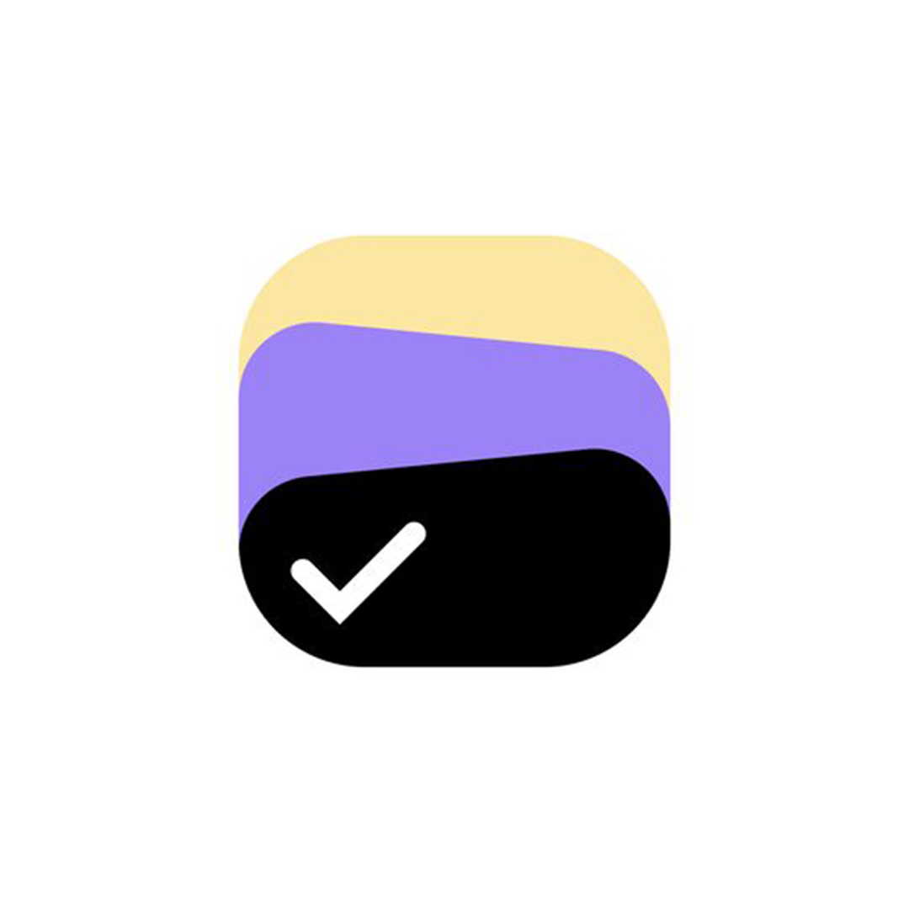
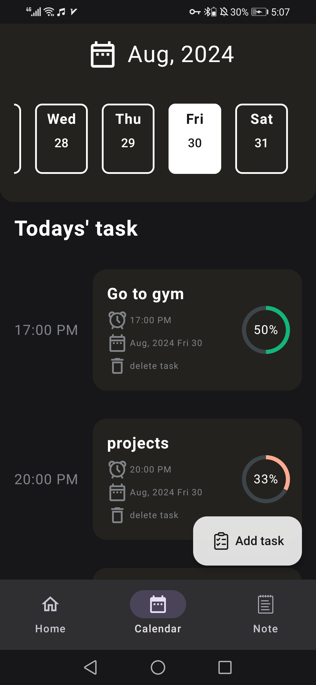
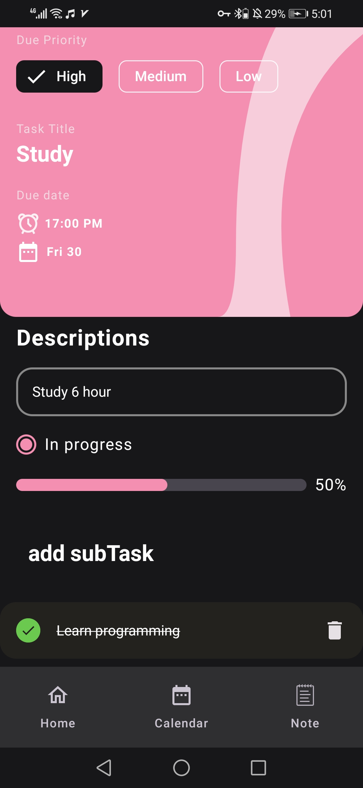
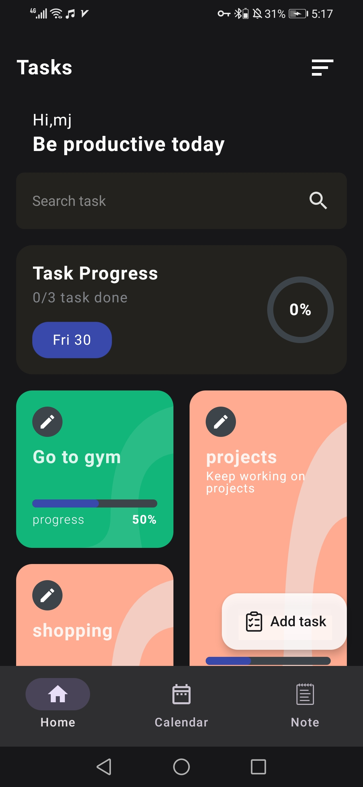
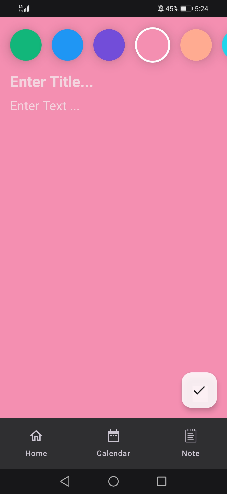
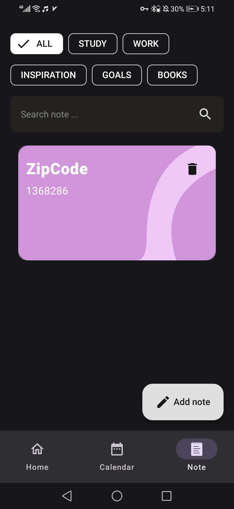

# Task Management 

Take full control of your tasks with our simple task management app. Whether adding, tracking progress, or checking smaller issues, this app makes your productivity easy and efficient.

Key features:

📋 Task management: Add and track your tasks.

🔄 Track progress: Stay motivated by marking off small tasks.

📝 Categorized notes: Organize your notes by categories like study or work.
## ScreenShots 

<table>
  <tr>
    <td align="center" width="20%">
      
    </td>
    <td align="center" width="20%">
      
    </td>
    <td align="center" width="20%">
      
    </td>
      <td align="center" width="20%">
      
    </td>
      <td align="center" width="20%">
      
    </td>
    
  </tr>
</table>
<!-- 

  
  
  
  
 

 -->

 ## Contributing

  Feel free to fork this repository and submit pull requests. For major changes, please open an issue first to discuss what you would like to change.

  ## License

  This project is licensed under the MIT License.

